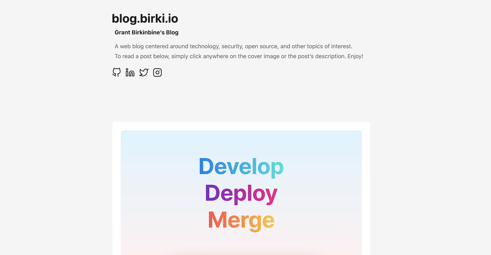

# blog 🌍

[](https://github.com/GrantBirki/blog/actions/workflows/deploy.yml) [](https://github.com/GrantBirki/blog/actions/workflows/ci.yml)

My personal blog

The live site can be found at [blog.birki.io](https://blog.birki.io)



## Development 💻

First, ensure you have the `hugo` binary installed. Then, run the following commands:

```bash
hugo server -D
```

This will start a local development server with live reloads

### WSL Note 📓

If you are using WSL, you will need to run the following commands to ensure the server is accessible from your browser:

```bash
ifconfig # find the IP address of your WSL instance

hugo server --bind <ip> --baseURL=http://<ip> -D
```

## New Blog Post 📝

To create a new blog post, run the following command:

```bash
hugo new posts/my-first-post.md
```

If you don't have the `hugo` binary installed, you can simply create a new folder + file in the `content/posts` directory with the following format:

> note: ensure the file is a `.md` file

```bash
---
title: "Budapest" # The title of the post
description: "Budapest trip" # required for open graph
date: 2017-06-23T00:00:00-07:00 # the date of the post
draft: false # whether or not the post is a draft
cover:
  image: "cover.jpg" # the relative path of the cover image in the media bundle - MUST be named cover.[jpg|png|etc]
  alt: "Budapest" # required for open graph
  caption: "Budapest" # required for open graph
  relative: true # required for open graph (since we use page bundles)
---

## Some cool title

Content goes here!
```

### Open Graph 🌐

> A quick note about [Open Graph](https://ogp.me/)

For both Open Graph and Twitter Cards to work correctly you **must** include the lines as seen below in your post front matter:

- `description` - the description that will be used in open graph
- `cover.image` - the relative path of the cover image in the media bundle - This file **must** be named `cover.[jpg|png|etc]`. It is just important that the file's name is `cover` and it has an image extension
- `cover.alt` - the alt text used in open graph
- `cover.caption` - the caption used in open graph
- `relative` - this is also required for open graph and Twitter Cards to work correctly. Since we use [page bundles](https://gohugo.io/content-management/page-bundles/), we need to set this to `true` every time

## Theme 🎨

This site uses the [hugo-PaperMod](https://github.com/adityatelange/hugo-PaperMod) theme

For more details on configuration, see the [features](https://github.com/adityatelange/hugo-PaperMod/wiki/Features) page on the theme's wiki

## Hugo Shortcodes 📄

Huge has a **ton** of built-in [shortcodes](https://gohugo.io/content-management/shortcodes/#use-hugos-built-in-shortcodes) that can do a bunch of things from rendering GitHub Gists, to Tweets, to YouTube videos, and a whole lot more.

## Video Support 📹

This site also supports embedded videos with the following extensions:

- `.mp4` / `.m4v`
- `.webm`
- `.ogv`

Add the video to the page bundle (alongside the `.md` file and images) and then you can reference the file without its extension like so:

```bash

```

or

```bash

```

> To learn more about the theme that provides video support, check out the [hugo-video](https://github.com/martignoni/hugo-video) repository

## Cloudflare Pages 🌩

This project uses [Cloudflare Pages](https://pages.cloudflare.com/) for static site hosting. A few things to note:

- This blog is a 100% static site. Due to this, I safely enabled `.html` file caching on cloudflare's edge network
- The **browser cache TTL** is set to 2 hours. This does **not** include the `.html` files (blog pages and their text). This does include images, css, and js files
- The **edge cache TTL** is set to 2 hours. This cached content includes images, css, and js files. New content will always be pulled down without issues (think "new blog posts") but modified content (think "updated blog posts") may take up to 2 hours to be updated in cloudflare's edge cache. `.html` files will be picked up by users once they are updated in the edge cache (as they are not cached by browsers) but other assets could need another (extra) 2 hours (or less) to be updated in the browser cache

### Why Cloudflare Pages

Nearly all of my other projects are hosted on GitHub Pages, so why did I choose Cloudflare Pages for this project?

- I wanted to try something new
- GitHub Pages has a "limit" of 100GB of bandwidth per month
- I needed to setup a [`_redirects`](./static/_redirects) file with Cloudflare to point `blog.birki.io` -> `journal.birki.io` where appropriate

The main annoyance with Cloudflare Pages is that if I make a **modification** to page `/foo/bar` then it will not show up right away as it is **cached** on cloudflare's edge network. If necessary, I would have to go into Cloudflare's UI and purge the entire `birki.io` domain which would clear the cache for all of my projects. GitHub Pages works a lot better in this regard as it will always serve the latest content on new deployments / modifications.
