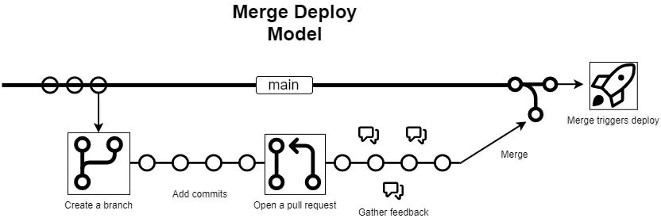
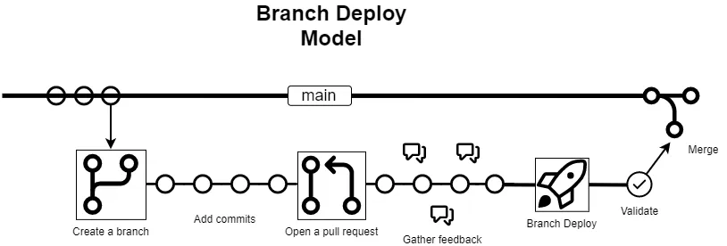

## Intro 💡

The most common way developers deploy their changes to production is the merge → deploy model. However, there is a significantly better way to ship our code to production. Rather than smash the merge button, cross our fingers, and hold onto our butts... we can hit merge with confidence that our change works exactly as we expect it to!

**Introducing… the branch deploy model!**

> If you have already heard of the branch deploy model and are familiar with it, you can skip ahead to get to the part where we implement it with GitHub Actions and IssueOps for a project

This article will go into **what** the branch deploy model is, **how** it works, and provide some resources to help you implement it in your own projects using **open source utilities**.

## Models 🏗️

In this section, we will discuss the two most common ways developers deploy their changes to production:

- The _merge → deploy_ model
- The branch deploy model

### Merge → Deploy Model

To really understand the branch deploy model, lets first take a look at a traditional merge → deploy model. It goes like this:

1. Create a branch
2. Add commits to your branch
3. Open a pull request
4. Gather feedback + peer reviews
5. Merge your branch
6. A deployment starts from the `main` / `master` branch

This model is known as the merge → deploy model because when we "merge" our branch, that is when the deployment starts. This model is quite common in less mature projects because it is simple to implement and easy to understand.

### Branch Deploy Model

Here are the steps for the branch deploy model:

1. Create a branch
2. Add commits to your branch
3. Open a pull request
4. Gather feedback + peer reviews
5. Deploy your change
6. Validate your change
7. Merge your branch

With the branch deploy model, we deploy our changes _before_ we merge our branch. This allows us to fully validate our changes before we merge them. By doing this, we can ensure that our `main` / `master` branch is highly stable and always deployable.

It should be noted that some projects actually do a second deployment during step "_7: Merge your branch_" to ensure that changes are still deployable after merging. This is entirely optional and depends on your project's needs.

### Visualizing the Models 🗺️

---



---



---

As you can see, the merge deploy model is inherently riskier because the `main` branch is never truly a stable branch. If a deployment fails, or we need to roll back, we follow the entire process again to roll back our changes. However, in the branch deploy model, the `main` branch is always in a "good" state and we can deploy it at any time to revert the deployment from a branch deploy. In the branch deploy model, we only merge our changes into `main` the branch once it has been successfully deployed and validated.

> This is sometimes referred to as the [GitHub Flow](https://docs.github.com/en/get-started/quickstart/github-flow)

## Pros and Cons 👍👎

Here is a quick summary of the pros and cons of each model:

**Merge Deploy Model**:

| Pros | Cons |
| :---: | :---: |
| ✅ Simple to implement | ❌ Risky |
| ✅ Easy to understand | ❌ Hard to rollback |
|| ❌ Difficult to preview changes |
|| ❌ Scales poorly on larger teams |
|| ❌ Places high ops load on maintainers |

**Branch Deploy Model**:

| Pros | Cons |
| :---: | :---: |
| ✅ Highly stable default branch | ❌ More complex to implement |
| ✅ Easy and reliable rollbacks ||
| ✅ Enables change previews ||
| ✅ Highly scalable for large teams ||
| ✅ Low ops load on maintainers ||
| ✅ Greater flexibility in configuration ||
| ✅ Higher deployment confidence ||
| ✅ Lower incident resolution time ||
| ✅ Increased deployment volume ||

## Key Takeaways ⭐

Key takeaways of the **branch deploy** model:

- The `main` branch is always considered to be a **stable and deployable branch**
- All changes are deployed to production **before** they are merged to the `main` branch
- To rollback a branch deployment, you deploy the `main` branch

Branch deployments are a battle tested way of deploying your changes to a given environment before merging them into your default branch.

Branch deployments allow you to do the following:

- Deploy your changes to production **before** merging
- Alternatively deploy changes to a staging, QA, or non-production environment

## Implementing Branch Deployments 🛠️

By taking the concepts learned in this post, you can implement branch deployments in pretty much any way you want. You can build solutions from scratch or use existing projects / tools to help you along.

Here is a list of links that will help you implement branch deployments in your own projects and take your deployments to the stars:

- [github/branch-deploy](https://github.com/github/branch-deploy) - A single open source GitHub Action that you can integrate into **any** repository to enable branch deployments
- [Enabling branch deployments through IssueOps with GitHub Actions](https://github.blog/2023-02-02-enabling-branch-deployments-through-issueops-with-github-actions/) - A blog post I wrote at GitHub about using IssueOps + Branch Deployments to leverage branch deployments

The [github/branch-deploy](https://github.com/github/branch-deploy) Action was designed to specifically help folks implement branch deployments in their projects. Whether you are a solo developer, a startup, or a massive enterprise, you can leverage the _branch-deploy Action_ to enable branch deployments in your projects. The best part is that this project is open source, and highly customizable to fit your needs.

This article won't go into too many details as the [official documentation](https://github.com/github/branch-deploy) is quite robust. Here is a quick example setting up the `github/branch-deploy` Action in your project to enable branch deployments via pull request comments:

```yaml
name: "branch deploy demo"

# The workflow to execute on is comments that are newly created
on:
  issue_comment:
    types: [created]

# Permissions needed for reacting and adding comments for IssueOps commands
permissions:
  pull-requests: write
  deployments: write
  contents: write
  checks: read

# The job that runs 'branch-deploy' logic
# This run runs on PR comments, looks for `.deploy` in said PR comment...
# ... and then executes your own custom deployment logic if the command is found
jobs:
  demo:
    if: ${{ github.event.issue.pull_request }} # only run on pull request comments
    runs-on: ubuntu-latest
    steps:
      # Execute IssueOps branch deployment logic, hooray!
      # This will be used to "gate" all future steps below and conditionally trigger steps/deployments
      - uses: github/branch-deploy@vX.X.X
        id: branch-deploy
        with:
          trigger: ".deploy" # the command to trigger a branch deployment

      # Run your deployment logic for your project here - examples seen below

      # Checkout your projects repository based on the ref provided by the branch-deploy step
      - uses: actions/checkout@v3
        with:
          ref: ${{ steps.branch-deploy.outputs.ref }}

      # Your own deployment logic goes here - it can be anything you want
      - name: fake regular deploy
        if: ${{ steps.branch-deploy.outputs.continue == 'true' }}
        run: echo "Add your own deployment logic in here, it could be anything you want!"
```

After setting up this GitHub Action in your project, you can invoke branch deployments via [IssueOps](https://github.com/github/branch-deploy/tree/d92479fbe9aa72262794c67fae581cf2c287eeac#issueops-%EF%B8%8F) commands as demonstrated in the demo video below:



### Live Examples

Here are some live examples of branch deployments in action:

- [**This Blog!**](https://github.com/GrantBirki/blog/blob/6f951a51cf7519509b3025d439c3676c610babe7/.github/workflows/branch-deploy.yml) - That's right! The very text you are reading on this page was branch deployed using [github/branch-deploy](https://github.com/github/branch-deploy) and GitHub Actions
- [github/entitlements-config](https://github.com/github/entitlements-config/blob/076a1f0f9e8cc1f5acb8a0b8e133b0a1300c8191/.github/workflows/branch-deploy.yml)
- [the-hideout/tarkov-api](https://github.com/the-hideout/tarkov-api/blob/be645d7750a0e440794229ce56aefeb4648b8892/.github/workflows/branch-deploy.yml) - A cloudflare workers example
- [the-hideout/cloudflare](https://github.com/the-hideout/cloudflare/blob/f3b189b54f278d7e7844e5cc2fcdbb6f5afd3467/.github/workflows/branch-deploy.yml) - A Terraform example

> For even more examples, check out the [github/branch-deploy documentation](https://github.com/github/branch-deploy/blob/d92479fbe9aa72262794c67fae581cf2c287eeac/docs/examples.md)

## Conclusion 🏁

If you are looking to enhance your DevOps experience, have better reliability in your deployments, or ship changes faster, then branch deployments are for you!

Whether you are a solo developer, a startup, or a massive enterprise, branch deployments are a truly battle tested way to confidently ship your code to production.

---

## References 📚

- [GitHub Flow](https://docs.github.com/en/get-started/quickstart/github-flow)
- [GitHub Blog Post](https://github.blog/2023-02-02-enabling-branch-deployments-through-issueops-with-github-actions/)
- [Deploying branches to GitHub.com](https://github.blog/2015-06-02-deploying-branches-to-github-com/)
- [Deploying at GitHub](https://github.blog/2012-08-29-deploying-at-github/)
- [Deployments from Branches](https://confluence.atlassian.com/bamboo/deployments-from-branches-407724097.html)
- [Medium](https://medium.com/better-programming/branch-deployments-with-issueops-and-github-actions-d9405311ad8b) - My original article on Medium
