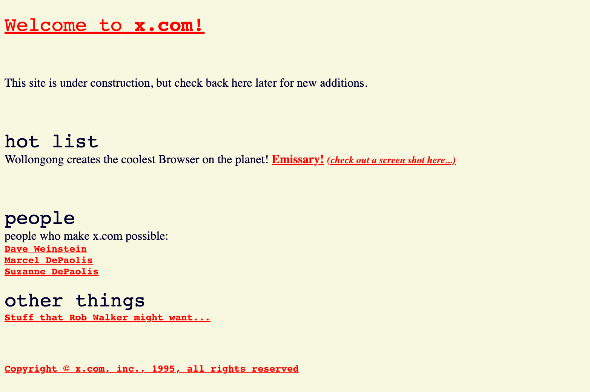
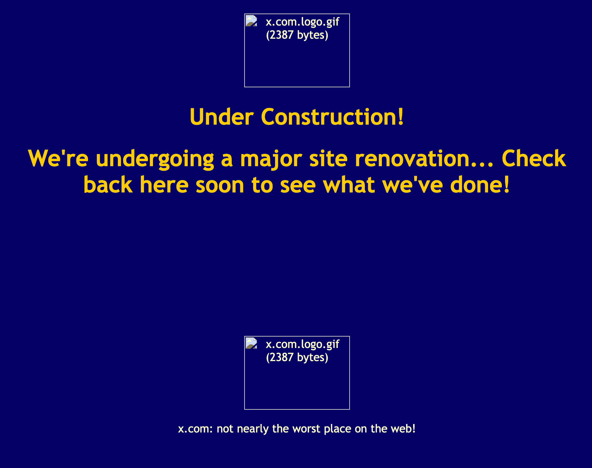
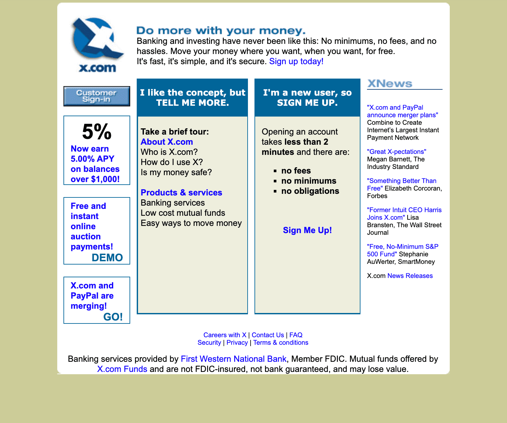
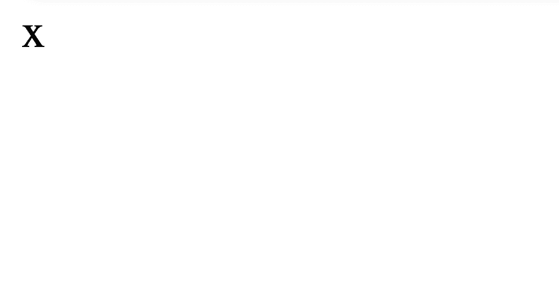
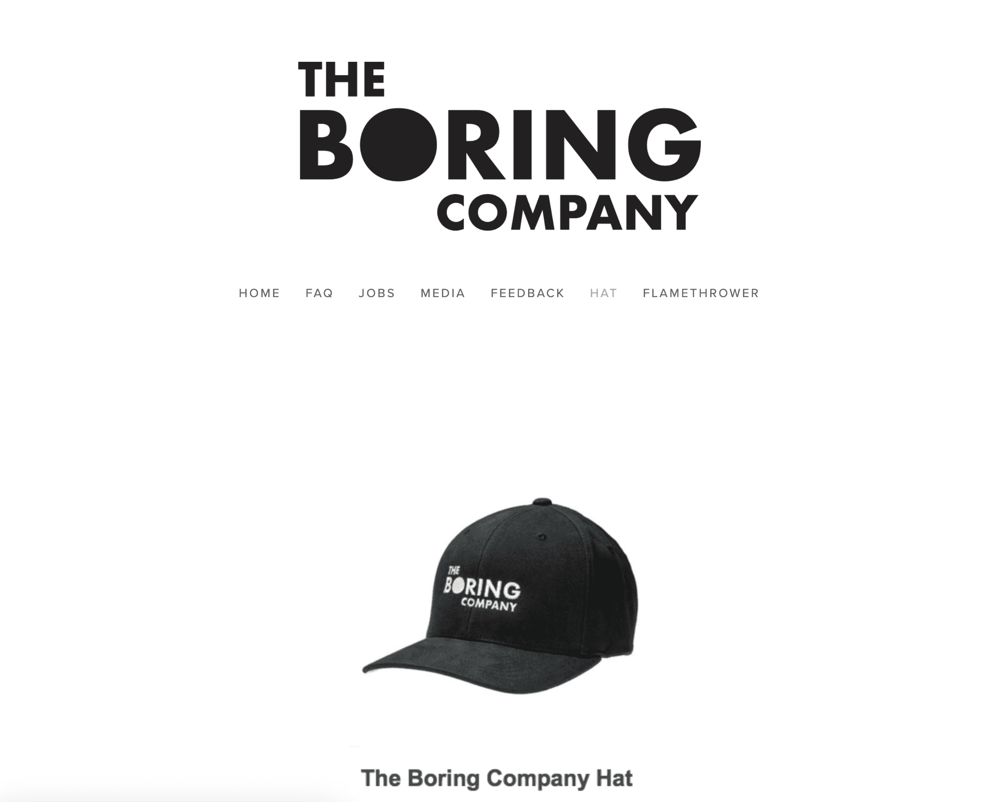

> x.com in 1996 - [source](https://web.archive.org/web/19961219022100/http://x.com/)

> x.com in 1997 - [source](https://web.archive.org/web/19970411224438/http://x.com/)

> x.com in 1998 - [source](https://web.archive.org/web/19981205063857/http://www.x.com/)

> x.com in 1999 - [source](https://web.archive.org/web/19990429170509/http://www.x.com/)

> x.com in early 2000 - [source](https://web.archive.org/web/20000301000000*/http://www.x.com/)

> x.com in late 2000 - [source](https://web.archive.org/web/20001019043926/http://www.x.com/)

> x.com in 2012 - [source](https://web.archive.org/web/20120629033626/https://www.x.com/)

For a while, x.com just redirects to ebayinc.com

> x.com in 2017 - [source](https://web.archive.org/web/20170731220848/http://x.com/)

> x.com in 2018 - [source](https://web.archive.org/web/20180228174126/http://x.com/) - [redirect to hat sale](https://web.archive.org/web/20180428210848/https://www.boringcompany.com/hat)

> x.com in 2023 (August 1st) - [redirect to twitter](https://web.archive.org/web/20230801001017/http://x.com/)
